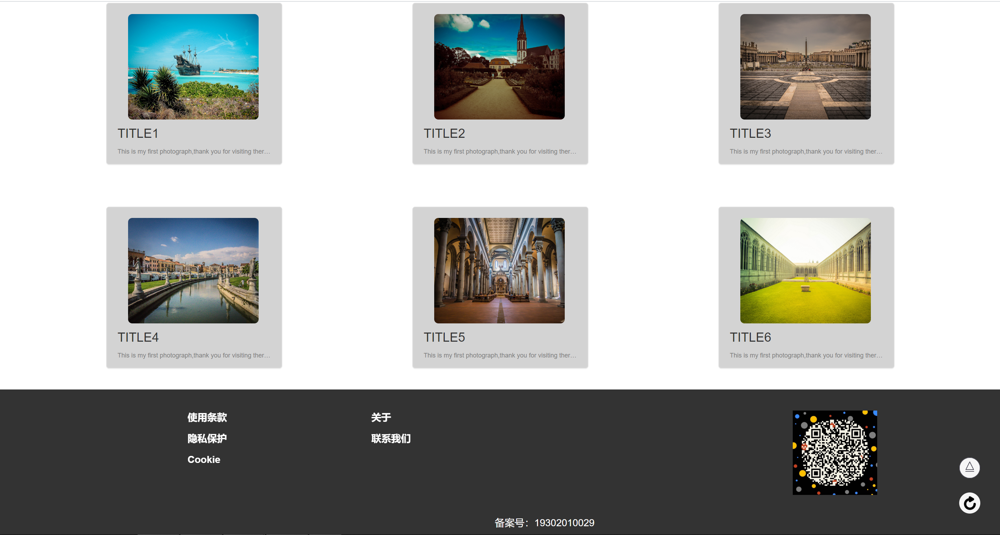

##lab4设计文档
蔡建栋 19302010029 
####1.主页截图

 
####2.所采取的布局
（1）在导航栏部分，参照助教给的代码，使用class="navbar navbar-nav"实现前一部分的导航栏，
在下拉菜单部分，通过class="nav navbar-nav nav-pills navbar-right"和class="dropdown"
来实现。 
（2）头图部分按要求实现轮播图，此部分通过改变图片的宽高使得图片与页面完全契合。 
（3）下一部分是内容简介部分，使用了bootstrap中的panel和panel-body，再在css
文件中改变panel的宽度和高度，调整float=left使图片合理排列在页面中。 
（4）在页脚部分，添加了自己的WeChat二维码。并按PJ1的要求添加了返回顶部和刷新的按钮。 
注：（1）（2）（4）部分copy了参考代码并进行了部分修改。（有些地方并不清楚如何使用故与参考代码完全一致）